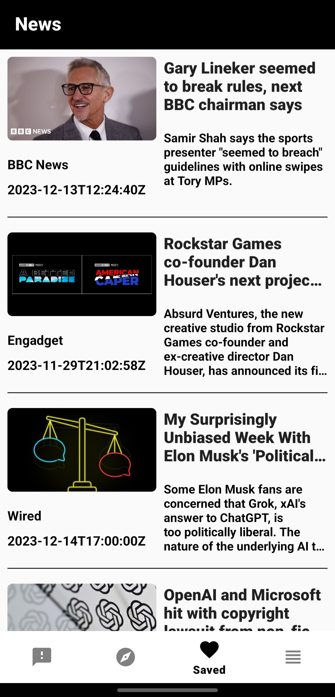
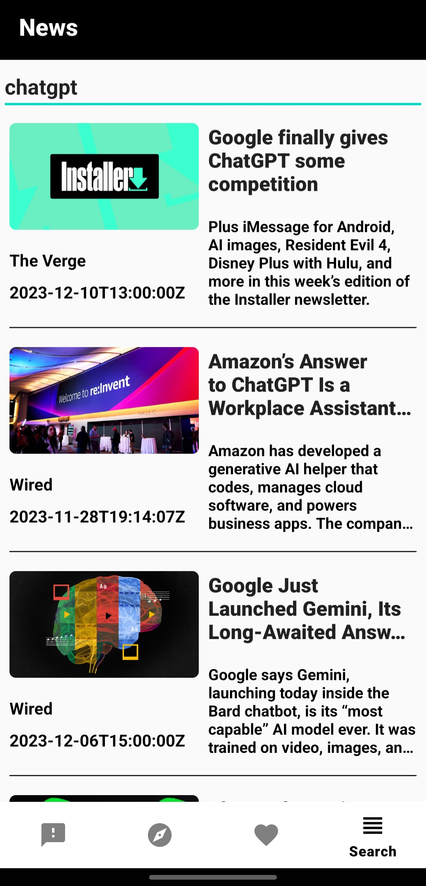
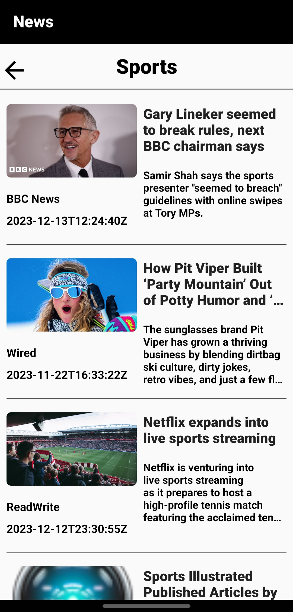

# MVVMNews
 MVVMNewsApp

 Bu proje, MVVM (Model-View-ViewModel) mimarisi kullanılarak geliştirilmiş bir haber uygulamasını içermektedir.

##Genel Bakış

Bu proje, API kullanarak haber verilerini alıp gösteren bir Android uygulamasını içermektedir. Aşağıda, projeyi anlamak ve çalıştırmak için gerekli bilgiler bulunmaktadır.

##Özellikler

Haberlerin gösterimi için model tasarımı yapılmıştır , fragmentlarda bu tasarım üzerinden haberler kullanıcıya gösterilecektir.Tasarımda habere ait; görsel , kaynak , yükleme zamanı , başlık ve kısa özet gösterilmektedir.Recyclerview içinde gösterilen haberler tıklanıldığı zaman habere ait detaylar web view içinde kullanıcıya gösterilmektedir.

Breaking News Fragment içinde API den gelen son dakika haberleri kullanıcıya recyclerview içinde gösterilmektedir.İstenilen bir habere tıklanması ile haberin detaylarına web view içinde kullanıcıya gösterilmektedir.

Explore News Fragment içinde çeşitli kategoriler bulunmaktadır.Bu kategorilere tıklanması sonucunda kategoriye ait haberler recyclerview içinde kullanıcıya gösterilmektedir.

Haber web view içinde açıldığında tasrımda bir float action button bulunmaktadır.Bu buton yardımı ile mevcut haber room database içine kaydedilir ve kaydedilen haberler recyclerview içinde Saved News Fragment kısmında gösterilir.Burada haber sağa ve sola kaydırılması ile haberin room database içinden silme işlemi gerçekleştirilmektedir.Bu silme işlemi kullanıcıya bir snackbar ile gösterilmektedir.Snackbar içinde yer alan buton yardımıyla silinen haber istenirse tekrar room 
database içine kaydedilebilir.

SearchNewFragment kısmında ise bir edit text yardımı ile girdiğimiz değerler üzerinden sorgu yapabilmekteyiz.Elde edilen sonuçlar recyclerview içinde kullanıcıya gösterilmektedir.

##Kullanılan Teknolojiler

Kotlin

Android Architecture Components (ViewModel, LiveData)

ViewBinding

NavigationComponent

Retrofit

Glide

Database(room)

Coroutines

RecyclerView

WebView

## Ekran Görüntüleri

##Ek Bilgiler

Bu uygulama News API kullanılarak geliştirilmiştir.

##Kurulum

Proje dosyalarını bilgisayarınıza klonlayın veya ZIP olarak indirin.

https://github.com/hariellevardamir/MVVMNews.git

Android Studio'da projeyi açın.

API anahtarınızı util.Constants.kt dosyasında güncelleyin.

Projeyi çalıştırın.
